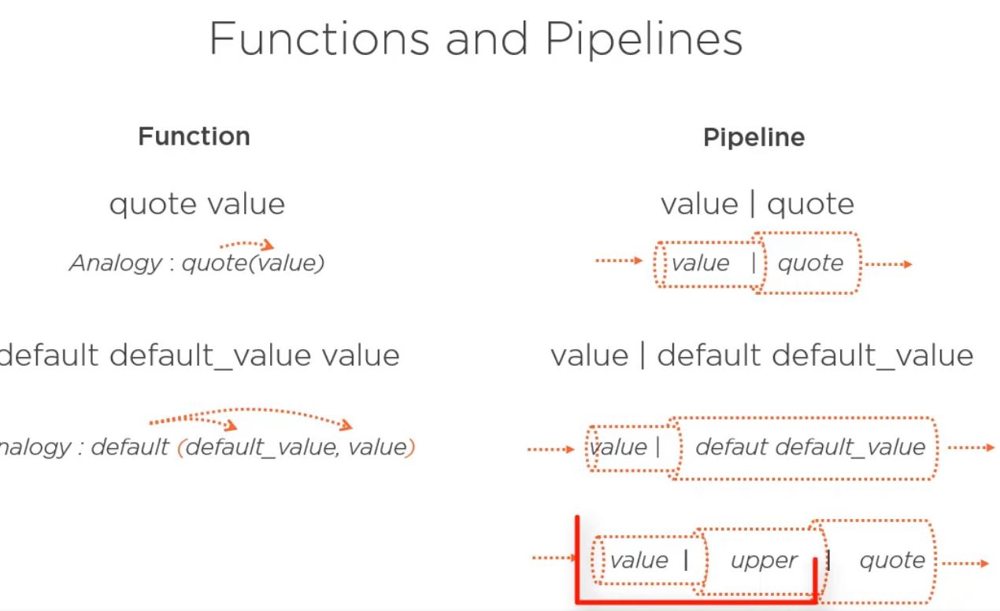
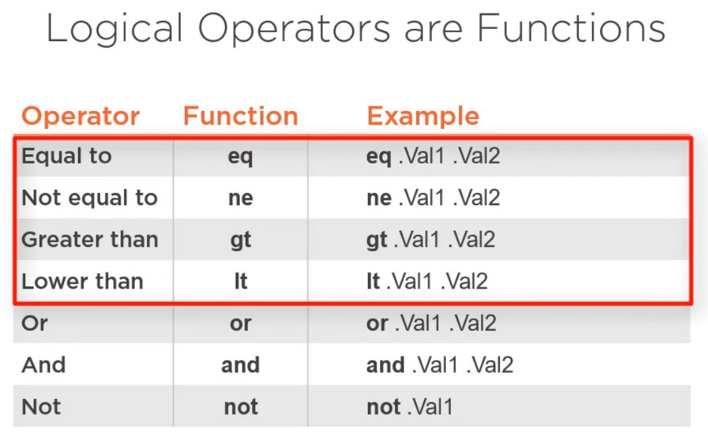
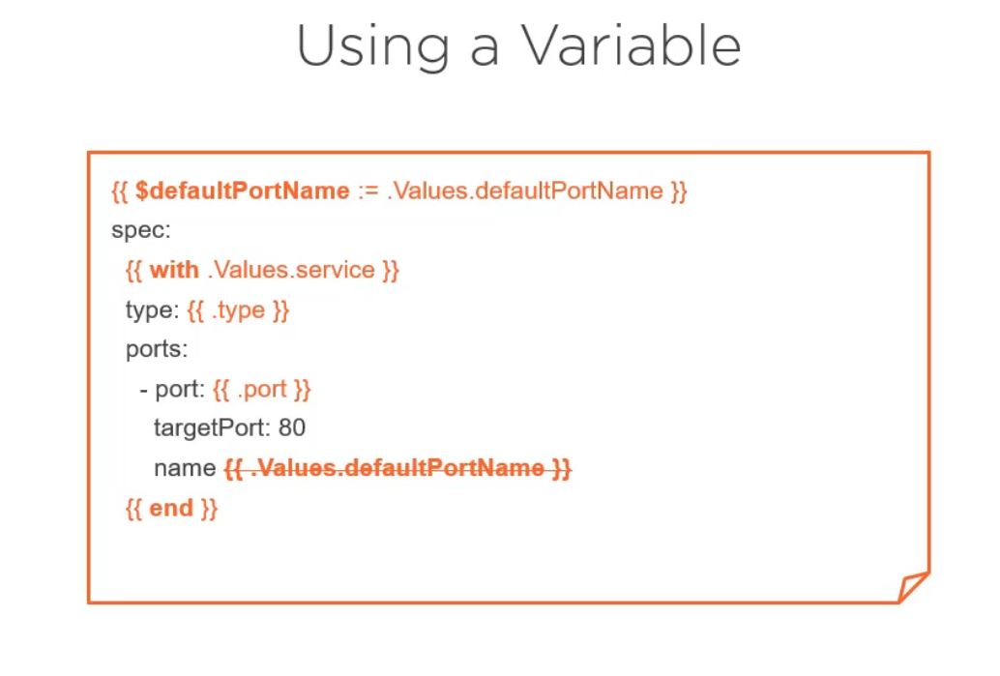

# Packaging Applications with Helm for Kubernetes course  
Ressources for "Packaging Applications with Helm for Kubernetes" (Helm version 3)

## Minikube installation
```
curl -o minikube https://storage.googleapis.com/minikube/releases/latest/minikube-linux-amd64
chmod +x minikube
sudo mv minikube /usr/local/bin/minikube
minikube version
minikube start
```

## Minikube configuration
```
minikube addons enable ingress
minikube ip
sudo vi /etc/hosts
```

## Kubectl installation
curl -LO https://storage.googleapis.com/kubernetes-release/release/
v1.17.0/bin/linux/amd64/kubectl
chmod +x kubectl
sudo mv kubectl /usr/local/bin/
kubectl version --short
minikube status


## Helm installation
```
curl -LO https://get.helm.sh/helm-v3.1.1-linux-amd64.tar.gz
tar -zxvf helm-v3.1.1-linux-amd64.tar.gz
sudo mv linux-amd64/helm /usr/local/bin/helm

helm version --short
kubectl config view

helm repo add stable https://kubernetes-charts.storage.googleapis.com/

```
## Helm MySql installation demo
helm install demo-mysql stable/mysql
kubectl get all | grep mysql

## Helm cleaning
```
kubectl get all | grep demo-mysql
kubectl get secret | grep demo-mysql
helm uninstall demo-mysql
kubectl get all | grep demo-mysql
kubectl get secret | grep demo-mysql
helm env
```
## Important advance URL
Sprig Project provides function in Helm Template Engine:
http://masterminds.github.io/sprig/






